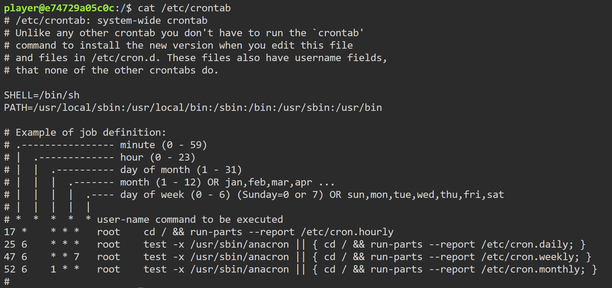
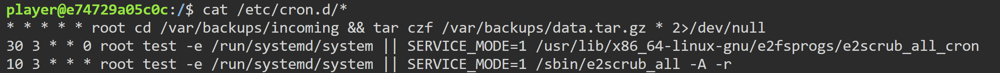
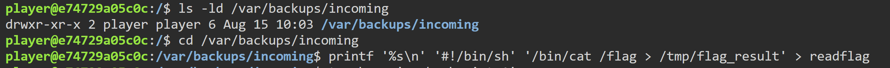
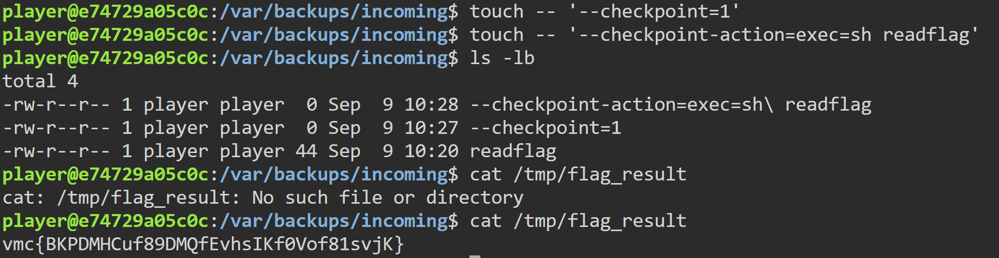

# 内网渗透与高级社工权限提升维持-G3 WriteUP

打开靶机地址，进入Web终端，可以看到此时用户权限为player,查看cron配置文件/etc/crontab,只有系统默认任务，没有明显提权点

接着查看/etc/cron.d/目录下文件内容，找到可用的提权点，每分钟执行一次，执行身份是root,可创建包含命令的文件名设法读取/flag

首先确认player在任务进入的目录中有创建文件等权限，随后进入目标目录，编写读取/flag的脚本程序readflag

touch创建两个特殊的文件名，让tar把文件名当成选项执行readflag,创建完成后等待系统执行该任务，读取flag_result中的内容获取flag
